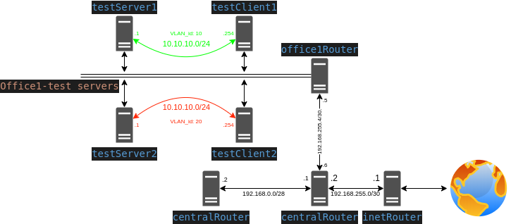
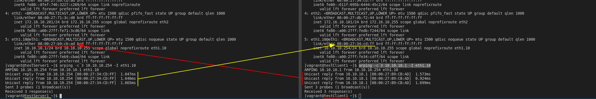
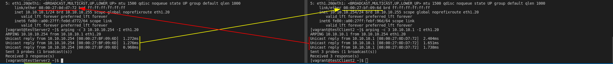
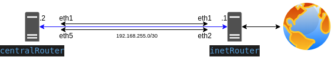
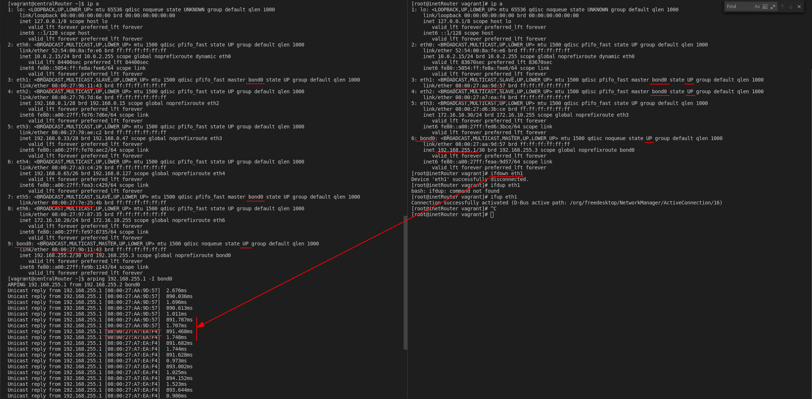

# Lesson 20 Сетевые пакеты. VLAN'ы. LACP.

Разворачиваем сетевую лабораторию

# Задание
строим бонды и вланы
в Office1 в тестовой подсети появляется сервера с доп интерфесами и адресами
в internal сети testLAN
- testClient1 - 10.10.10.254
- testClient2 - 10.10.10.254
- testServer1- 10.10.10.1
- testServer2- 10.10.10.1

равести вланами
testClient1 <-> testServer1
testClient2 <-> testServer2

между centralRouter и inetRouter
"пробросить" 2 линка (общая inernal сеть) и объединить их в бонд
проверить работу c отключением интерфейсов

для сдачи - вагрант файл с требуемой конфигурацией
Разворачиваться конфигурация должна через ансибл

## Решение:

За основу взят проверенный стенд из [Лабораторной работы №17](https://github.com/mbfx/otus-linux/tree/master/lab17). Отлючил все не используемые в стенде виртуалки.

##### Схема VLANs:

Проверяем доступность узла и укбедимся что мы "видим" только нужный нам хост.

##### Проверяем работу  vlan10:

##### Проверяем работу  vlan20:

##### Схема bond между inetRouter и centralRouter

##### проверяем работу bond
Для проверки отключим один из интефрейсов на котором поднять  bond и убедимся что доступность хоста не изменилась, но при это изменился MAC адрес.
На картинке видно что в момент отключения  одного интерфейса - второй интерфейс берет на себя функцию первого - тем самым обеспечивая доступность

