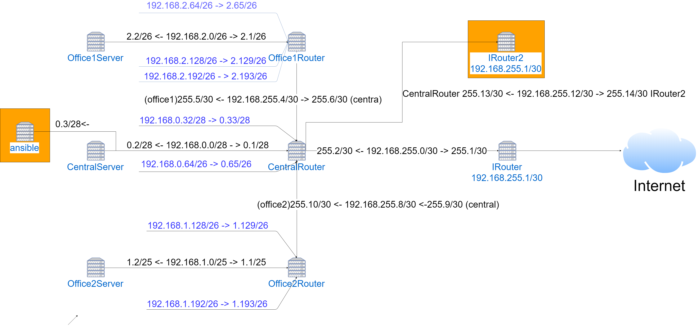

# Lesson 20 Фильтрация трафика

# Дано
Сценарии iptables
1) реализовать knocking port
- centralRouter может попасть на ssh inetrRouter через knock скрипт
пример в материалах
2) добавить inetRouter2, который виден(маршрутизируется) с хоста
3) запустить nginx на centralServer
4) пробросить 80й порт на inetRouter2 8080
5) дефолт в инет оставить через inetRouter


## Решение: 

 - [x] 1. Немного усложним. Для доступа на маршутизатор по SSH нужно прозвонить в определенной последовательноси 2 порта в течении 10 секунд. Если разница между попытками менее 10 сек то - успешно, открываем порт на 30 сек. Реализация [knocking port](Vagrantfile#L157-L196). Проверочный [Скрипт](knock.sh) для проверки запустить откуда нибудь с внутренней сети (проверка реализована только на внутреннем интерфейсе CentralRouter - eth1): ```/vagrant/knock.sh 192.168.255.1 3333 9965``` (в скрипте реализована задержка в виде ожидания нажатия клавиши пользователем, для проверки работы. Если между первой и второй попыткой пройдет более 10 сек - то правильная попытка прозвона второго порта ни к чему не придет. Начинать все нужно заного);
 - [x] 2. inetRouter2 добавлен. [Проброс порта](Vagrantfile#L204-L207) с inetRouter2 eth2:8080 на centralRouter:80 выполнен без маскарада; проверочная страничка откроется по [этой ссылке](http://192.168.11.130)
 - [x] 4. nginx запущен;
 - [x] 5. Выход в интернет все также проходит через inetRouter.

Схема сети:

Оранжевым помечены отличия от 18 лабы. добавилен inetRouter2 и машинка с ansible для развертывания nginx.
