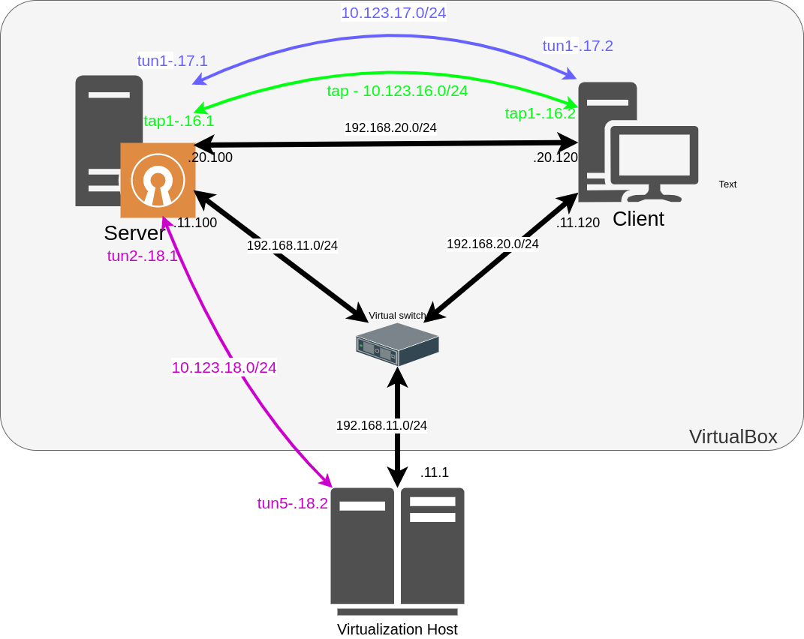

#### Мосты, туннели и VPN

#### Задание

VPN
1. Между двумя виртуалками поднять vpn в режимах
- tun
- tap
Прочуствовать разницу.

2. Поднять RAS на базе OpenVPN с клиентскими сертификатами, подключиться с локальной машины на виртуалку

#### Решение

В репозитории находится [Vagrantfile](Vagrantfile) + [Ansible role](ansible), которые
  - Разворачивают сервер CA на server;
  - генерирует сертификаты для server;
  - генерирует сертификаты для client;
  - Разворачивают на server сервер openvpn на порту 1201/udp в режиме tap;
  - Разворачивают на server сервер openvpn на порту 1202/tcp в режиме tun;
  - Разворачивают на client клиент openvpn и подключается к server режимах tap, tun с конфигурациями см выше. [Проверка](images/tap-tun.png);
  - Разворачивают на server сервер openvpn на порту 1203/tcp в режиме tun авторизацией по сертификату, имени пользователя и паролю. ([Пример](images/ras.png)), [проверка](images/tcp-ping.png) ;

Для проверки RAS OpenVPN можно использовать:
  - Cертификаты, которые автоматически сгенерируются в /tmp/server на локальной машине.
  - [Конфигурация](OVPN-client-config/VPN-connect.ovpn) OPENVPN клиента
  - Имя пользователя и пароль - vagrant / vagrant.

Схема сети:

Разница tun и tap режимов:

- TAP:
  - Преимущества:
    - Почти как настоящий - можно использовать как ethernet интерфейс;
    - Любой сетевой протокол (IPv4, IPv6 и прочих);
    - Работает на 2 уровне;
    - Позволяет использовать мосты.
  - Недостатки:
    - В тоннель попадает broadcast-трафик хотя это как плюс так и минус;
    - Добавляет свои заголовки поверх заголовков Ethernet на все пакеты, которые следуют через тоннель;

- TUN:
  - Преимущества:
    - Передает только пакеты протокола IP (3й уровень);
    - сравнительно (отн. TAP) меньшие накладные расходы и, фактически, ходит только тот IP-трафик, который предназначен конкретному клиенту.
  - Недостатки:
    - broadcast-трафик обычно не передаётся;
    - нельзя использовать мосты.
