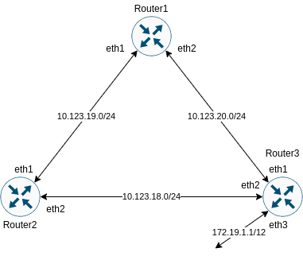

# Lesson 24 OSPF

## Задание

1. Поднять три виртуалки
2. Объединить их разными private network
   - Поднять OSPF между машинами средствами программных маршрутизаторов на выбор: Quagga, FRR или BIRD
   - Изобразить ассиметричный роутинг
   - Сделать один из линков "дорогим", но что бы при этом роутинг был симметричным


## Решение:<br/>

#### Решение
Vagrant file разворачивает 3 роутера на базе centos 7 и ansible для настройки всего остального.

Схема схети:<rb/>



На стенде настроена OSPF согласоно заданию. На роутере router1 настроена ассиметричная маршрутизация (изменен вес маршрута для eth2)
#### Проверка:

- На любом из роутеров проверяем что frr находится в рабочем состоянии:

```
[root@router1 frr]# systemctl status frr
● frr.service - FRRouting
   Loaded: loaded (/usr/lib/systemd/system/frr.service; enabled; vendor preset: disabled)
   Active: active (running) since Sun 2020-02-23 12:52:59 UTC; 6min ago
     Docs: https://frrouting.readthedocs.io/en/latest/setup.html
  Process: 27611 ExecStop=/usr/lib/frr/frrinit.sh stop (code=exited, status=0/SUCCESS)
  Process: 27630 ExecStart=/usr/lib/frr/frrinit.sh start (code=exited, status=0/SUCCESS)
   CGroup: /system.slice/frr.service
           ├─27635 /usr/lib/frr/watchfrr -d zebra ospfd staticd
           ├─27650 /usr/lib/frr/zebra -d -A 127.0.0.1 -s 90000000
           ├─27654 /usr/lib/frr/ospfd -d -A 127.0.0.1
           └─27657 /usr/lib/frr/staticd -d -A 127.0.0.1
```

- Проверяем маршруты на машине:

```
[root@router1 frr]# ip r
default via 10.0.2.2 dev eth0 proto dhcp metric 100
10.0.2.0/24 dev eth0 proto kernel scope link src 10.0.2.15 metric 100
10.123.18.0/24 proto 188 metric 20
	nexthop via 10.123.19.2 dev eth1 weight 1
	nexthop via 10.123.20.3 dev eth2 weight 1
10.123.19.0/24 dev eth1 proto kernel scope link src 10.123.19.1 metric 101
10.123.20.0/24 dev eth2 proto kernel scope link src 10.123.20.1 metric 102
172.16.0.0/12 via 10.123.20.3 dev eth2 proto 188 metric 20

```
Если цена маршрутов разная то таблица маршрутов будет выглядеть несколько иначе:

```
[root@router2 vagrant]# ip r
default via 10.0.2.2 dev eth0 proto dhcp metric 100
10.0.2.0/24 dev eth0 proto kernel scope link src 10.0.2.15 metric 100
10.123.18.0/24 dev eth2 proto kernel scope link src 10.123.18.2 metric 102
10.123.19.0/24 dev eth1 proto kernel scope link src 10.123.19.2 metric 101
10.123.20.0/24 via 10.123.18.3 dev eth2 proto 188 metric 20
172.16.0.0/12 via 10.123.18.3 dev eth2 proto 188 metric 20
```

Маршрут до конечной точки определен однозначно через опреденный шлюз.

- Проверяем работу динамической маршутизации
   Методика проверки: отправляем тестовый пакет между роутером и сетовым сервером в удаленной сети, удостоверяемся что  ответ есть. Выключаем интерфейс, который обеспечивает кратчайший маршрут, повторяем эксперимент. Проверяем как изменилась таблица маршрутизации:
  1. На router1 проверяем связь между router1 и тестовым сервером 172.20.6.10:
      ```
      [root@router1 vagrant]# traceroute 172.20.6.10
      traceroute to 172.20.6.10 (172.20.6.10), 30 hops max, 60 byte packets
      1  10.123.19.2 (10.123.19.2)  0.263 ms  0.187 ms  0.195 ms
      2  10.123.20.3 (10.123.20.3)  0.759 ms  0.658 ms  0.710 ms
      3  172.20.6.10 (172.20.6.10)  0.930 ms  0.898 ms  0.858 ms
      ```
  2. На router3 выключаем интерфейс eth1 на router3 (шаг 2 трассировки в п.1 - ip 10.123.20.3):
      ```
      [root@router3 vagrant]# ifdown eth1
      Device 'eth1' successfully disconnected.
      [root@router3 vagrant]# ip a |grep inet
      inet 127.0.0.1/8 scope host lo
      inet 10.0.2.15/24 brd 10.0.2.255 scope global noprefixroute dynamic eth0
      inet 10.123.18.3/24 brd 10.123.18.255 scope global noprefixroute eth2
      inet 172.19.1.1/12 brd 172.31.255.255 scope global noprefixroute eth3
      inet6 fe80::a00:27ff:fe97:6dd5/64 scope link
      ```
   3. На router1 повторно проверяем связь между router1 и тестовым стендом 172.20.6.10:
      ```
      [root@router1 vagrant]# traceroute 172.20.6.10
      traceroute to 172.20.6.10 (172.20.6.10), 30 hops max, 60 byte packets
      1  10.123.19.2 (10.123.19.2)  0.380 ms  0.217 ms  0.298 ms
      2  10.123.18.3 (10.123.18.3)  0.547 ms  0.406 ms  0.392 ms
      3  172.20.6.10 (172.20.6.10)  0.869 ms  0.848 ms  0.701 ms
      ```
Симметричная машрутизация, с дорогим одним из линков.
  На схеме это router1  - router3. Для того что бы изменить  маршрут между router1 и некоторым криентом за router3 - изменим стоимость маршрутов между router1 и router3 на значение 100. (Остальные значение 10).  т.е. снижаем  цену этого машрута - в результате трафик пойдет через router2.

## Запуск\подготовка к работе:

### Требования:

OS: Win/Linux/Mac
Soft: Vagrant, Virtual Box
Доступ в интернет.

### Запуск:

Для развертывания тестового стенда из папки с репозиторием себя запустите:

`vagrant up`

и ждем когда завершится развертывание виртуальных машин.
