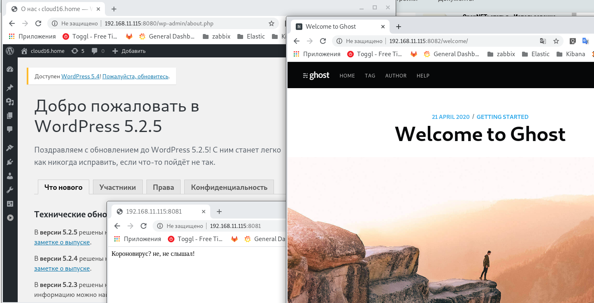

#### Роль для настройки web-сервера

#### Задание

Роль для настройки веб сервера
Варианты стенда
nginx + php-fpm (laravel/wordpress) + python (flask/django) + js(react/angular)
nginx + java (tomcat/jetty/netty) + go + ruby
можно свои комбинации

Реализации на выбор
- на хостовой системе через конфиги в /etc
- деплой через docker-compose

#### Результат

 	Сделал Vagrantfile с Ansible ролью, который подготавливает к запуску в каталоге /opt на виртуальной машине docker-compose файл с необходимыми конфигурационными файлами. 

​	Для того чтобы запустить web-сервер, нужно перейти в каталог ```/opt``` и выполнить команду ```sudo docker-compose up -d```. После завершения запуска контейнеров  запустится:

 - Порт 8080 - Wordpress (PHP+FPM + MySQL);
   - [nginx config](ansible_repo/roles/webserver/templates/wordpress_nginx.conf.j2)
   - [php config](ansible_repo/roles/webserver/templates/wordpress_php.ini.j2)
   
 - Порт 8081/tcp - Python/Flask/uWSGI;
   - [nginx config](ansible_repo/roles/webserver/templates/python_nginx.conf.j2)
   - DockerHub образ c Python 
   
 - на 8082/tcp - Ghost CMS (NodeJS + MySQL).

   - [nginx config](ansible_repo/roles/webserver/templates/ghost_nginx.conf.j2)

   

   Дополнительно:

    - [Vagrantfile](Vagrantfile);
    - [Ansible repo](ansible_repo/roles);
    - [docker-compose](ansible_repo/roles/webserver/templates/docker-compose.yml.j2);

Результат:

http://192.168.11.115:8080/

http://192.168.11.115:8081/

http://192.168.11.115:8082/

