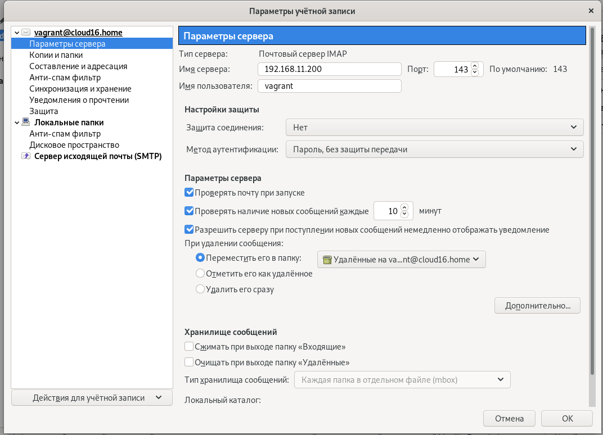
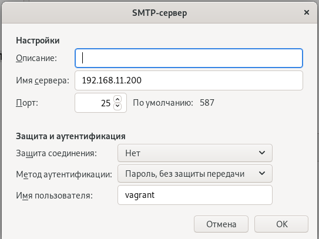
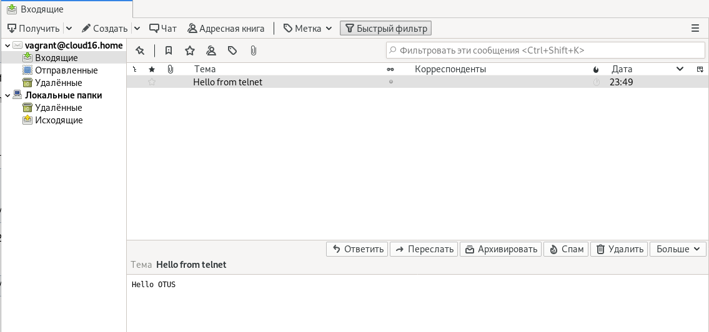

# Lesson30: SMTP, IMAP, POP3

## Домашнее задание

установка почтового сервера

1. Установить в виртуалке postfix+dovecot для приёма почты на виртуальный домен любым обсужденным на семинаре способом
2. Отправить почту телнетом с хоста на виртуалку
3. Принять почту на хост почтовым клиентом

Результат

1. Полученное письмо со всеми заголовками
2. Конфиги postfix и dovecot

## Решение
1. Запуск виртуалок осуществляется командой
    ```bash
    vagrant up
    ```

1. Отправим почту через telnet.
    ```bash
    telnet 192.168.11.200 25

    ehlo server.cloud16.home
    mail from: a.agafonov@cloud16.ru
    rcpt to: vagrant@cloud16.home
    data
    Subject: Hello from telnet
     Hello OTUS
    .
    ```

1. Настраиваем Thunderbird client


  * Настройки (password: "SuperSecret")

    

    

  * Результат
    

**Исходный текст письма:**

```
Return-Path: <a.agafonov@cloud16.ru>
X-Original-To: vagrant@cloud16.home
Delivered-To: vagrant@cloud16.home
Received: from server.cloud16.home (unknown [192.168.11.1])
	by mailserver.cloud16.home (Postfix) with ESMTP id 3A795537F
	for <vagrant@cloud16.home>; Sun,  5 Apr 2020 00:33:07 +0300 (MSK)
Subject: Hello from telnet

Hello OTUS
```


**Конфиги**

- [postfix](ansible/roles/postfix-server/templates/main.cf)

- dovecot:

  отличия от конфигурации по умолчанию описаны на шаге "allow: password authentication,auth without ssl,dovecot to read users emails dir; disable: ssl, set: mail location" роли [dovecot](ansible/roles/dovecot/tasks/main.yml#L21-L33)

