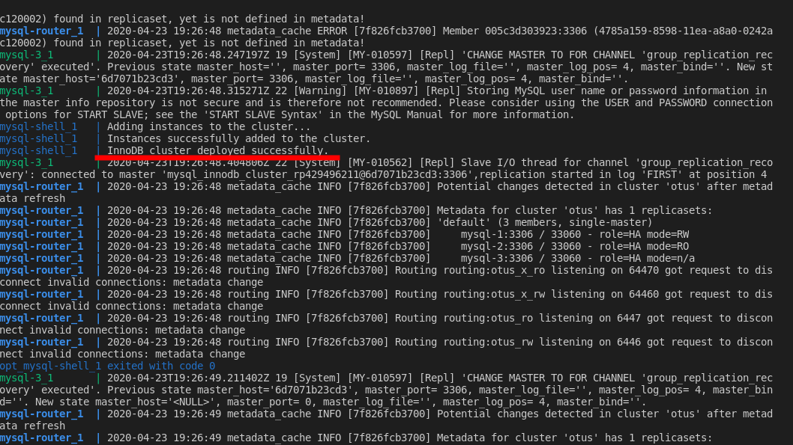
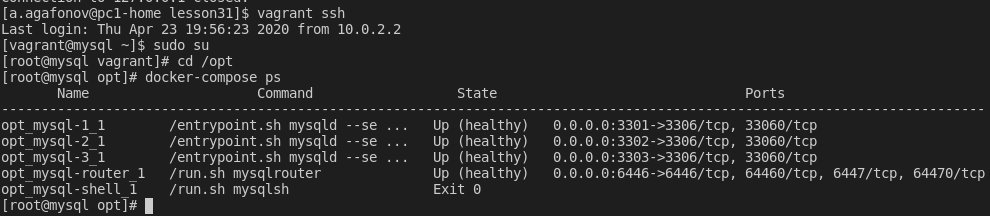
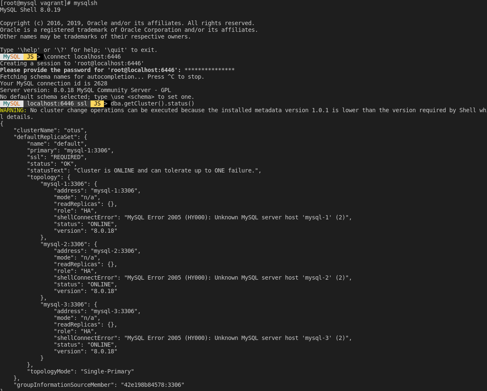

# Lesson 31 MySQL - бэкап, репликация, кластер

развернуть InnoDB кластер в docker
развернуть InnoDB кластер в docker*
* в docker swarm

В качестве ДЗ принимает репозиторий с docker-compose
который по кнопке разворачивает кластер и выдает порт наружу

# Решение

Запуск кластера осуществляется при помощи команду `Vagrant up`
Поднимается виртуальная машина, для удобства устанавливается `mysqlsh` на хостовую машину и запускается 3 контейнера с установленной mysqld,  контейнер с  mysql-router, а так же вспомогательный контейнер для развертывания кластера.

Проверяем статус развертывания:

Проверяем состояние контейнеров и номера открытых портов:

Проверяем состояние кластера:

