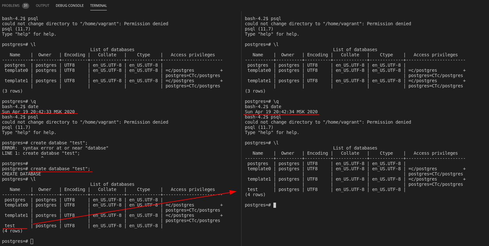
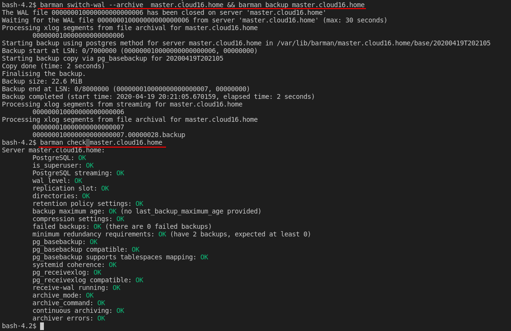

# PostgreSQL

#### Задание

PostgreSQL
- Настроить hot_standby репликацию с использованием слотов
- Настроить правильное резервное копирование

Для сдачи работы присылаем ссылку на репозиторий, в котором должны обязательно быть:
-  Vagranfile и плейбук Ansible,
-  конфигурационные файлы postgresql.conf, pg_hba.conf и recovery.conf,
-  а так же конфиг barman, либо скрипт резервного копирования.

Команда "vagrant up" должна поднимать машины с настроенной репликацией и резервным копированием. Рекомендуется в README.md файл вложить результаты (текст или скриншоты) проверки работы репликации и резервного копирования.


#### Решение

Развернуто 3 машины при помощи [плейбук Ansible](ansible/roles)и [Vagrantfile](Vagrantfile)

 - [postgresql.conf](ansible/roles/postgres_replication/templates/postgresql-master.conf.j2);
 - [recovery.conf](ansible/roles/postgres_replication/templates/recovery.conf.j2);
 - [/etc/barman.conf](ansible/roles/postgres_barman/templates/etcbarman.conf.j2)

Проверить репликацию можно  создать базу данных командой ```create database "test";``` на master, а после проверить её существование командой ```\l``` на replica.



Что бы проверить резервное копирование:

```
barman check master.cloud16.home
barman switch-wal --archive  master.cloud16.home && barman backup master.cloud16.home
barman check master.cloud16.home
```



Для ускорения разверывания  можно запустить ```bash vagrantup.sh``` вместо ```vagrant up```. Так же в конф файле добавил переиспользование ssh сесий - что тоже даёт существенный прирост в скорости развертывания. По окончании развертывания на экран будет выведено затрраченное на развертывание время в сек.