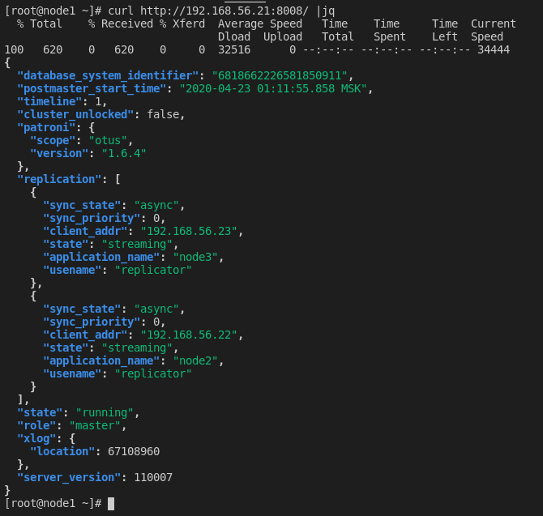
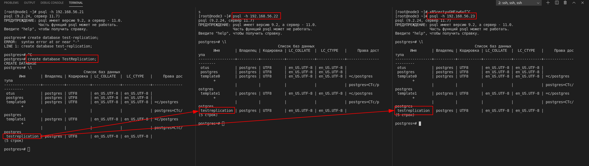
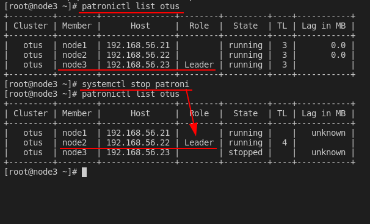
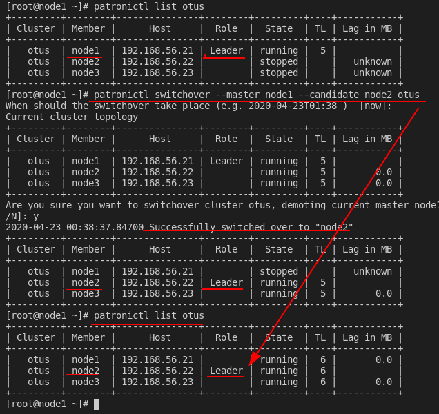
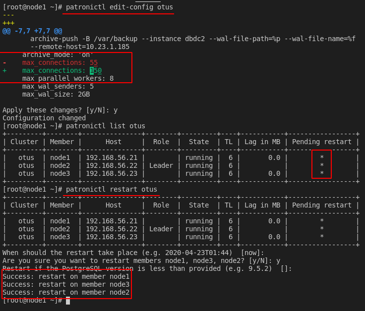
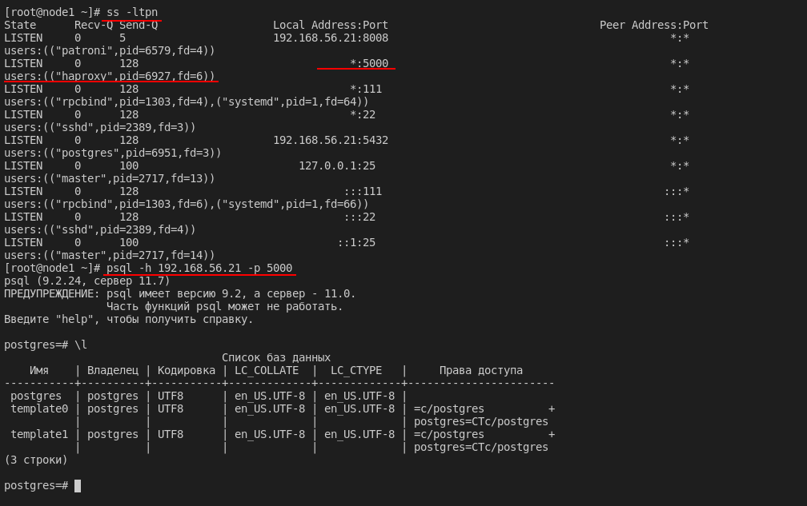

# PostgreSQL cluster

- Развернуть кластер PostgreSQL из трех нод. Создать тестовую базу
- проверить статус репликации
- Сделать switchover/failover
- Поменять конфигурацию PostgreSQL + с параметром требующим перезагрузки
- Настроить клиентские подключения через HAProxy

### Решение

Для запуска необходимо выполнить команду:

```console
vagrant up
```

Если дииски быстрые - можно немного ускорить и запустить

```console
bash +x vagrantup.sh
```

### Проверки работы

Проверяем статус Patroni




Создать тестовую базу и проверить работу репликации:



Проверяем автоматический failover:



Проверяем switchover:





Меняем параметр (max_connections), требующий перезапуска кластера:




Подуключаемся через HAProxy



